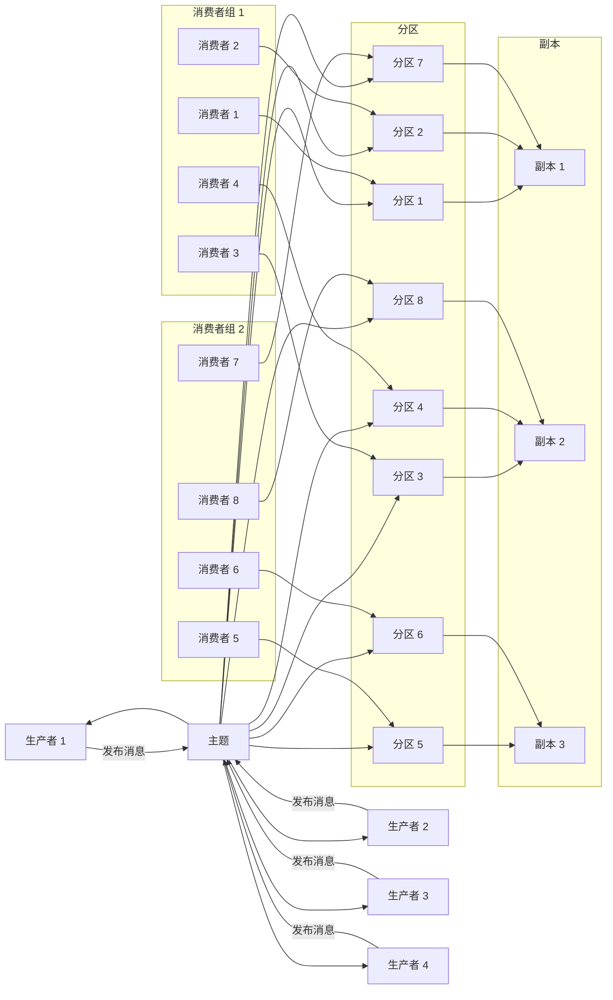

## 1 为什么需要消息队列

### 1.1 哪些问题适合使用消息队列来处理？

1. 异步处理
2. 流量控制
3. 服务解耦
4. 发布/订阅（观察者模式）
5. 流式计算

## 2 该如何选择消息队列

## 3 消息模型：主题和队列有什么区别

- 队列模型
- 发布 - 订阅模型

```mermaid
graph LR
    P1[生产者 1] -->|发布消息| T[主题]
    P2[生产者 2] -->|发布消息| T
    P3[生产者 3] -->|发布消息| T
    P4[生产者 4] -->|发布消息| T
    T --> P1
    T --> P2
    T --> P3
    T --> P4
    subgraph 分区
        P1A[分区 1]
        P1B[分区 2]
        P1C[分区 3]
        P1D[分区 4]
        P1E[分区 5]
        P1F[分区 6]
        P1G[分区 7]
        P1H[分区 8]
    end
    T --> P1A
    T --> P1B
    T --> P1C
    T --> P1D
    T --> P1E
    T --> P1F
    T --> P1G
    T --> P1H

    subgraph 副本
        R1[副本 1]
        R2[副本 2]
        R3[副本 3]
    end

    P1A --> R1
    P1B --> R1
    P1C --> R2
    P1D --> R2
    P1E --> R3
    P1F --> R3
    P1G --> R1
    P1H --> R2

    subgraph 消费者组 1
        C1[消费者 1]
        C2[消费者 2]
        C3[消费者 3]
        C4[消费者 4]
    end
    C1 --> P1A
    C2 --> P1B
    C3 --> P1C
    C4 --> P1D

    subgraph 消费者组 2
        C5[消费者 5]
        C6[消费者 6]
        C7[消费者 7]
        C8[消费者 8]
    end
    C5 --> P1E
    C6 --> P1F
    C7 --> P1G
    C8 --> P1H
```
