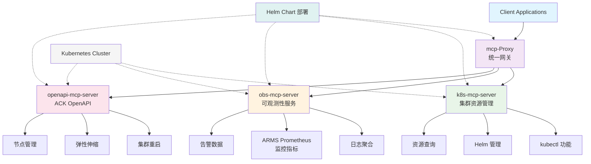

```mermaid
graph TD
    A[Client Applications] --> B[mcp-Proxy<br/>统一网关]
    
    B --> C[k8s-mcp-server<br/>集群资源管理]
    B --> D[obs-mcp-server<br/>可观测性服务]
    B --> E[openapi-mcp-server<br/>ACK OpenAPI]
    
    C --> C1[kubectl 功能]
    C --> C2[Helm 管理]
    C --> C3[资源查询]
    
    D --> D1[日志聚合]
    D --> D2[ARMS Prometheus<br/>监控指标]
    D --> D3[告警数据]
    
    E --> E1[集群重启]
    E --> E2[弹性伸缩]
    E --> E3[节点管理]
    
    F[Kubernetes Cluster] -.-> C
    F -.-> D
    F -.-> E
    
    G[Helm Chart 部署] -.-> B
    G -.-> C
    G -.-> D
    G -.-> E
    
    style A fill:#e1f5fe
    style B fill:#f3e5f5
    style C fill:#e8f5e8
    style D fill:#fff3e0
    style E fill:#fce4ec
    style F fill:#f5f5f5
    style G fill:#e0f2f1
```
